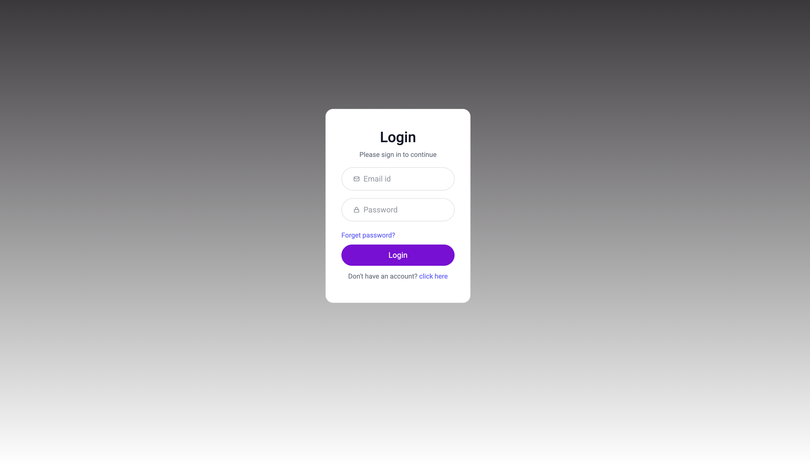
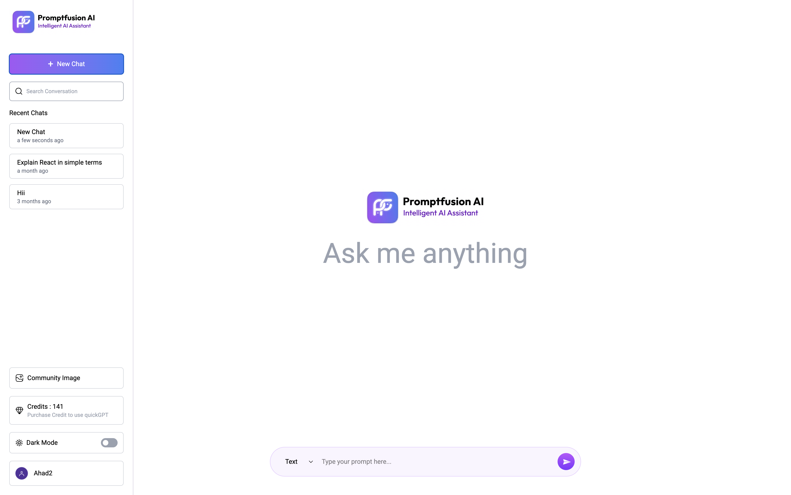
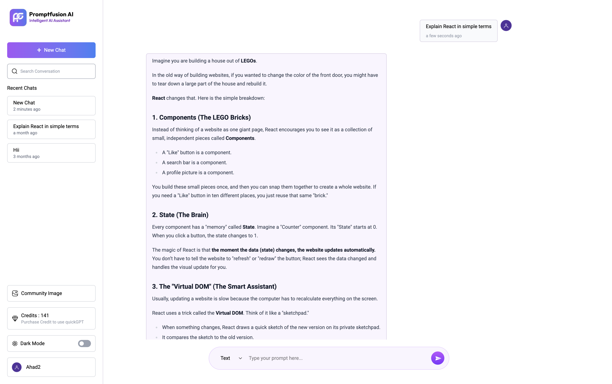
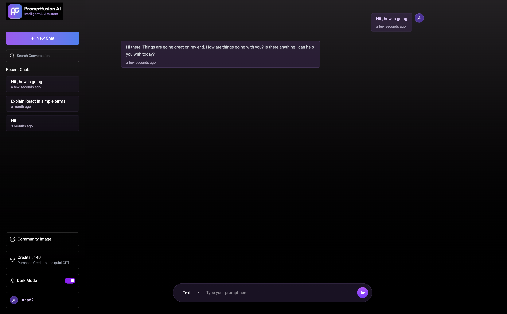

# 🤖 PromptFusion AI – Intelligent Multimodal AI Assistant

<div align="center">

# PromptFusion AI

A powerful full-stack AI assistant built using the MERN Stack that enables users to interact with advanced AI models through a modern, responsive, and user-friendly interface.

### 🚀 Live Demo
https://promptfusion-multimodal-ai.vercel.app

### 📂 GitHub Repository
https://github.com/mohdasad-dev/promptfusion-multimodal-ai

</div>

---

## 📖 Overview

PromptFusion AI is a full-stack AI-powered platform designed to provide intelligent conversational experiences. The application allows users to create and manage conversations, interact with advanced AI models, track credits, and securely manage their accounts.

The platform is built with scalability, performance, and user experience in mind, making it suitable for real-world AI-powered applications.

---

## ✨ Features

### 🤖 AI Assistant
- Real-time AI conversations
- Intelligent response generation
- Context-aware interactions
- Multimodal AI support

### 🔐 Authentication & Security
- JWT Authentication
- Secure User Registration & Login
- Password Hashing using bcryptjs
- Protected Routes

### 💬 Chat Management
- Create New Chats
- Search Conversations
- Chat History Storage
- Persistent Sessions

### 🎨 User Interface
- Responsive Design
- Modern Dashboard
- Dark Mode Support
- Mobile Friendly

### 💳 Credit Management
- User Credit Tracking
- Usage Monitoring
- Credit-Based Access Control

### ☁️ Deployment Ready
- Frontend hosted on Vercel
- Backend deployment support
- MongoDB Atlas integration

---

## 🛠️ Tech Stack

### Frontend
- React.js
- Tailwind CSS
- Axios
- React Router DOM

### Backend
- Node.js
- Express.js

### Database
- MongoDB Atlas

### Authentication
- JWT
- bcryptjs

### AI Integration
- OpenAI API
- Gemini API

### Deployment
- Vercel
- Render

### Version Control
- Git
- GitHub

---

## 📂 Project Structure

```bash
promptfusion-multimodal-ai/
│
├── client/
│   ├── public/
│   ├── src/
│   │   ├── assets/
│   │   ├── components/
│   │   ├── pages/
│   │   ├── context/
│   │   ├── hooks/
│   │   ├── services/
│   │   ├── utils/
│   │   ├── App.jsx
│   │   └── main.jsx
│   │
│   └── package.json
│
├── server/
│   ├── controllers/
│   ├── middleware/
│   ├── models/
│   ├── routes/
│   │   ├── userRoutes.js
│   │   ├── chatRoutes.js
│   │   ├── messageRoutes.js
│   │   └── creditRoutes.js
│   │
│   ├── config/
│   ├── server.js
│   └── package.json
│
├── .env
├── README.md
└── package.json
```

---

<h2>📸 Screenshots</h2>

<p align="center">
  
  
</p>

<p align="center">
  
  
</p>

> Create a folder named **screenshots** in your root directory and place all images inside it.

```bash
screenshots/
├── home.png
├── dashboard.png
├── chat.png
├── darkmode.png
└── login.png
```

---

## ⚙️ Installation

### Clone the Repository

```bash
git clone https://github.com/mohdasad-dev/promptfusion-multimodal-ai.git
```

### Navigate to Project Directory

```bash
cd promptfusion-multimodal-ai
```

### Install Frontend Dependencies

```bash
cd client
npm install
```

### Install Backend Dependencies

```bash
cd ../server
npm install
```

---

## 🔑 Environment Variables

Create a `.env` file inside the server directory.

```env
PORT=5000

MONGODB_URI=your_mongodb_connection_string

JWT_SECRET=your_jwt_secret

OPENAI_API_KEY=your_openai_api_key

GEMINI_API_KEY=your_gemini_api_key
```

---

## ▶️ Running the Project

### Start Backend Server

```bash
npm run server
```

### Start Frontend

```bash
npm run dev
```

---

## 🌐 Deployment

### Frontend
- Vercel

### Backend
- Render

### Database
- MongoDB Atlas

---

## 🚀 Future Enhancements

- Voice Assistant Integration
- AI Image Generation
- PDF & Document Analysis
- Team Collaboration Workspace
- Prompt Library
- Multi-Model Support
- AI Agent Workflows

---

## 👨‍💻 Author

### Md Asad

GitHub:
https://github.com/mohdasad-dev

LinkedIn:
https://linkedin.com/in/mohdasad-dev

---

## ⭐ Support

If you found this project useful:

⭐ Star the Repository

🍴 Fork the Project

🛠️ Contribute Improvements

📢 Share with Others

---

<div align="center">

### 🚀 Built with MERN Stack & AI Technologies

PromptFusion AI – Intelligent Multimodal AI Assistant

</div>
